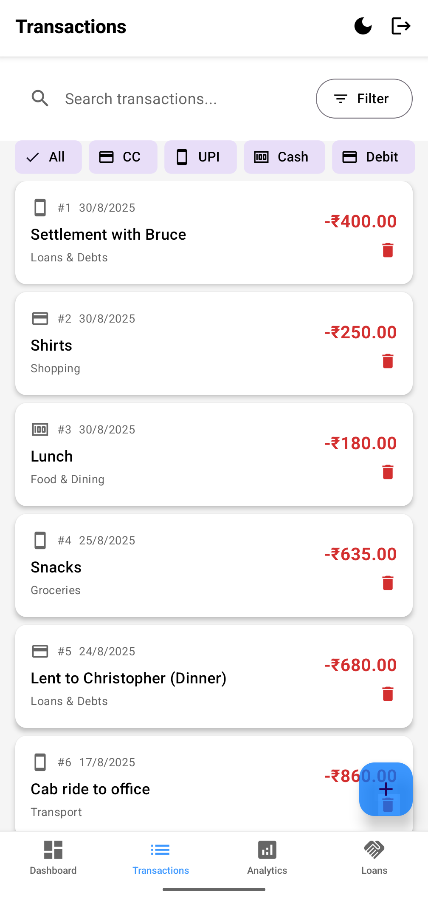

<div align="center">
  
  <h1>Drachm0 🪙</h1>
  <p>
    <strong>A modern, intuitive expense tracker for managing personal finances with ease.</strong>
  </p>
  <p>
    
    
    
  </p>
</div>

<br />

<div align="center">
  
</div>

<br />

> The name **Drachm0** is inspired by the **Drachma**, the ancient Greek currency, combined with **0**, representing the power of zero to amplify value in the numerical world.

---

## ✨ Key Features (v1.0)

| Feature | Description |
| :--- | :--- |
| 📊 **Smart Dashboard** | Get an at-a-glance overview of your total balance, monthly income/expenses, and totals for money lent or owed. |
| 💸 **Transactions** | Effortlessly add, edit, and delete income or expense transactions. Categorize everything for better organization and filter by payment modes like UPI, Credit Card, etc. |
| 🤝 **Loans & Debts** | A dedicated system to track money lent to or borrowed from people. Lending money automatically debits your balance, and settlements correctly credit it back without inflating your income stats. |
| 📈 **Visual Analytics** | Dive deep into your spending habits with interactive charts. View breakdowns by category or payment mode, and analyze trends with daily (1M) or monthly (3M, 6M, 1Y) spending charts. |
| 🎨 **Dual Theming** | Seamlessly switch between a clean **Light Mode** and a sleek **Dark Mode**. Your preference is automatically saved and remembered the next time you open the app. |
| 🔒 **Authentication** | A secure login and registration system to ensure your financial data remains private and accessible only to you. |

---

## 📸 Screenshots

| Dashboard (Dark Mode) | Analytics (Dark Mode) |
| :---: | :---: |
|  |  |

| Transactions (Light Mode) | Loans & Debts (Light Mode) |
| :---: | :---: |
|  |  |

---

## 🛠 Tech Stack

The app is built with a modern, cross-platform stack:

| React Native | Expo | React Navigation | React Native Paper | Expo-SQLite |
| :----------: | :--: | :--------------: | :----------------: | :---------: |
| _Framework_ | _SDK_ | _Navigation_ | _UI Kit_ | _Database_ |

---

## 🚀 Future Features (v2.0 Roadmap)

Here's what's planned for the next major version of Drachm0:

* **👤 Profile Section**: A dedicated area for users to manage their account details and preferences.
* **🧠 Enhanced Analytics**: Introduction of more in-depth charts and data visualizations to provide smarter recommendations on spending and saving habits.
* **Long-Term Goal (v3.0)**: Integration of a chat model to analyze finances conversationally and provide personalized recommendations.

---

## 🚀 Getting Started

To get a local copy up and running, follow these simple steps.

### Prerequisites

* Node.js (LTS version)
* `npm` or `yarn`
* Expo Go app on your Android or iOS device

### Installation

1.  Clone the repository:
    ```sh
    git clone https://github.com/benzps01/Drachm0.git
    ```
2.  Navigate into the project directory:
    ```sh
    cd Drachm0
    ```
3.  Install NPM packages:
    ```sh
    npm install
    ```
4.  Start the development server:
    ```sh
    npx expo start
    ```
5.  Scan the QR code with the Expo Go app on your phone.

---

## 🌟 Acknowledgments

This application was built using 'Vibe Coding,' a conversational development methodology. Google's Gemini generated the core architecture and features, while ChatGPT-4 provided support for specific bug fixes.
---

## 📜 License

This project is released into the public domain. See the [LICENSE](./LICENSE) file for details.
